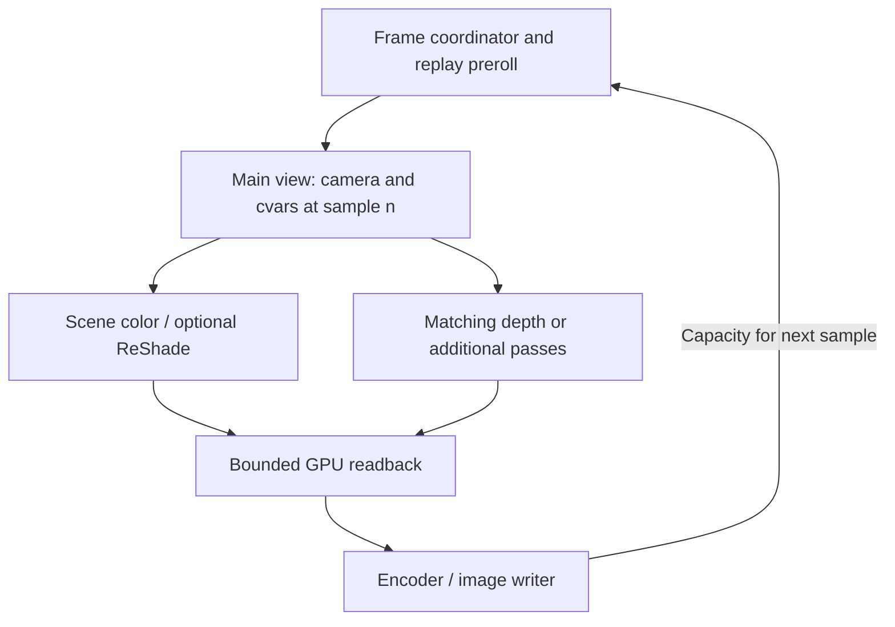

# Renderer stability, ReShade and Stage 3 export

Research date: September 10, 2026.

## Implementation status — 0.5.0

Real-time, video-only MP4 capture and an optional ReShade color-effects/menu
integration are implemented. See [Video and ReShade](VIDEO_AND_RESHADE.md).
The 0.4.8 recorded-packet changes are retained. The owner reports stable 0.4.7
playback; that native camera hook/interpolation remains unchanged here.

Fixed-step output with preroll, synchronized audio, depth texture integration
and separate scene layers remain designs below, not delivered features.
The earlier renderer crash evidence remains unresolved and must be considered
before enabling a blocking offline frame gate.

## Recorded-demo compatibility

The supplied dolly1.dem is a completed Source 2 / SourceTV demo. Its metadata
reports 51,585 ticks in 806.015625 seconds, consistent with 64 simulation ticks
per second. It contains 17,019 ordinary packets, spaced three or four ticks
apart. The logs identify Dolly 0.3.13 and show the replay loading successfully;
the error occurs in old paused-camera calibration afterward.

| Requested tick | Previous packet | Next packet |
| --- | --- | --- |
| 22,632 | 22,631 | 22,634 |
| 22,636 | 22,634 | 22,637 |
| 48,393 | 48,391 | 48,394 |

A rendered pause can expose an in-between tick. Reconstructing a replay at that
exact tick is a different operation from holding its already-rendered scene.
The current native flight system avoids the old adjacent-tick calibration.
The 0.4.8 packet-aware native shot seek explicitly targets the next recorded
packet when necessary, then applies the existing strict seek verification.
Camera and effect phase use the actual tick on the original saved timeline.
For example, 48,393 to 48,394 skips 1/64 of a replay second at the start; it does
not shift every key. This is reported in the activity log. A shot ending before
the next packet is rejected. Unknown or incomplete indexing keeps exact seeking.

This interactive playback policy is not the final export policy. An exporter
must reconstruct an earlier packet and perform controlled preroll so that the
requested first output frame is retained. It must not silently apply the same
initial skip to a frame-accurate export.

## A concrete lead for the severe slowdown

September 12 update: the post-setup camera correction now synchronizes the
auxiliary origins/angles and cached camera basis described below. It preserves
the existing camera evaluation timing. See [Native camera visibility](CAMERA_VISIBILITY.md).
This is a correction for stale camera state, not a demonstrated fix for the
historical renderer overflow or all visibility consumers inside SetUpView.
The analysis below records the earlier implementation.

Dolly currently changes the camera after Deadlock's SetUpView function returns,
before the caller constructs the view matrices. Static inspection of the
reviewed September 9 client build establishes that SetUpView has already
cached the original camera position, angles and forward/right/up vectors.
A verified CParticleSystemQuery method reads those cached position/angle values
for a bounds, direction and visibility calculation.

| Consumer | Camera state it can receive today |
| --- | --- |
| Final main-view matrices | Dolly's overridden pose |
| Cached camera and the identified particle visibility query | Game-provided pose before Dolly's override |

This establishes a consistency problem. It does **not** prove that the query
caused the fatal vertex-buffer overflow: the older minidump lacks the relevant
camera globals and buffer-queue backing memory, and the dynamic particle caller
has not been conclusively attributed.

HLAE applies its Source 2 camera change earlier, inside SetUpView, and allows
subsequent view setup to continue. That ordering is the useful reference;
its CS2 addresses and object layouts cannot be reused as Deadlock addresses.
[HLAE camera implementation](https://github.com/advancedfx/advancedfx/blob/main/AfxHookSource2/main.cpp)

The next camera prototype should apply origin and rotation after the game
chooses its camera but before it derives those caches. Final FOV/aspect handling
happens later, so simply moving the existing callback is insufficient. It needs
one pose evaluation per frame, then final projection/effect/status processing
using that same sample. Later callbacks that can modify the view must be checked.
Main-view identity, exact-build verification and release/replay transitions must
remain intact. Copying only the cached origin would leave angles and basis
inconsistent; copying every global afterward does not establish correct ordering
for consumers inside SetUpView.

The existing slowdown history contains long intervals near 1.4 main views per
second with roughly 6,000 pending renderer buffers. Guide drawing sometimes
stops while the slowdown continues. Completed overlay and original Present calls
can both be short, which means those CPU timings do not explain the entire
frame. F9 releases/rearms the camera and changes input, HUD and other settings;
its recovery does not isolate one cause.

The added view history reuses validated native telemetry once per second and
records original/applied poses alongside input and graphics observations.
Original pose is a pre-override view measurement, not an independent reading of
the engine caches. The native hook and renderer are unchanged in this patch.

If 0.4.7/0.4.8 still collapses in the same scene, the useful next measurement is
a short CPU/GPU trace spanning the slow period and one F9 recovery, plus Dolly
diagnostics exported before recovery. Microsoft GPUView records scheduling,
GPU submissions and resource events; WPR offers CPU and GPU activity profiles.
These can distinguish scene CPU work, driver/resource waiting and GPU saturation.
The official GPUView workflow starts/stops Log.cmd and produces Merged.etl;
keep the reproduction brief rather than recording a whole editing session.
[GPUView workflow](https://learn.microsoft.com/en-us/windows-hardware/drivers/display/using-gpuview),
[WPR profiles](https://learn.microsoft.com/en-us/windows-hardware/test/wpt/built-in-recording-profiles)

Dolly's D3D11.1 context swap is a documented way for a plugin to preserve device
state. It is not a GPU completion barrier or a buffer-retirement fix. Immediate
context calls still need correct thread serialization.
[Microsoft context-state API](https://learn.microsoft.com/en-us/windows/win32/api/d3d11_1/nf-d3d11_1-id3d11devicecontext1-swapdevicecontextstate)

## ReShade integration

ReShade compatibility is feasible, but currently unverified in Deadlock Dolly.
The present overlay preserves D3D state and chains the window procedure; it has
no explicit ReShade detection, effect ordering or agreement about mouse ownership.

Use an optional adapter with one active graphics backend for the game swapchain.
Keep the existing backend when ReShade is absent. With a supported ReShade runtime,
coordinate drawing and capture through its API so two paths do not process the
same frame. The camera engine remains independent of that choice.

| Output | Intended capture point |
| --- | --- |
| Clean scene | Before ReShade effects |
| Scene with the selected preset | After effects, before overlay UI |
| Dolly editor on screen | Draw after image capture |

ReShade exposes begin/finish-effects callbacks; its present callback runs after
its own overlay. The effect callbacks need a fallback when effects are disabled,
empty or loading, because the current runtime can return before invoking them.
A valid export must still capture exactly one frame in those states.
[ReShade events](https://crosire.github.io/reshade-docs/namespacereshade.html),
[ReShade runtime source](https://github.com/crosire/reshade/blob/main/source/runtime.cpp)

An engine-aware adapter can later supply explicit color/depth resources through
the effect-runtime API. HLAE has a separate ReShade adapter using explicit
resources, but its supported games are CS:GO/CS2.
[Effect-runtime API](https://crosire.github.io/reshade-docs/structreshade_1_1api_1_1effect__runtime.html),
[HLAE adapter](https://github.com/advancedfx/ReShade_advancedfx)

Opening ReShade must release Dolly flight mouse ownership. Closing it must return
to the correct editor/game state, with F7 console access preserved. Test effects
on/off, reload, alt-tab, resize, full-screen changes, F7/F8/F9 and shutdown.
Start with SDR and one tested runtime/preset set. Shader timers, randomness and
temporal histories require separate treatment for repeatable offline export.

Keep ReShade optional. Do not overwrite an existing installation or leave an
unexpected loader in the ordinary game directory. Link to the official ReShade
download and distribute Dolly's own adapter separately from third-party shader
packs. Retain existing session ownership and -dev -insecure launch restrictions.
[Official ReShade distribution](https://reshade.me/)

## Normal-video export

HLAE's recorder uses fixed simulation timing, render-thread coordination, staging
textures and a separate processing worker. Its Source 2 implementation changes
host_framerate and several capture-related settings, including r_wait_on_present,
then restores them. Those are references to validate against Deadlock, not a
reason to change those cvars automatically as a lag workaround.
[HLAE recording implementation](https://github.com/advancedfx/advancedfx/blob/main/AfxHookSource2/RenderSystemDX11Hooks.cpp)

For output FPS F and playback speed S, frame n represents replay time
start + n*S/F, with video timestamp n/F. At 60 FPS and 0.1 speed, each frame
advances replay time by 1/600 second. Native Updates / s remains monitoring speed;
it cannot set this export cadence. Rational frame rates should use an integer
or rational frame counter rather than accumulated floating-point additions.

The proposed pipeline is:

Attach the sample identifier to the render work that produces the image. Reading
the latest camera status at Present is insufficient if the renderer is processing
an earlier submitted frame. Validate engine, animation and particle time as well
as the camera: a file labelled 60 FPS is not proof of correct 60-FPS sampling.

Use reusable, bounded color/readback buffers. GPU copies are asynchronous; mapping
immediately can stall. Respect texture format, multisampling and row pitch. The
encoder worker consumes owned CPU buffers and does not use the game's immediate
D3D context concurrently. Backpressure should stop simulation at a verified frame
boundary where pending graphics work can still finish. Existing input, Present
and camera callbacks must not become blocking encoder or disk workers.
[CopyResource](https://learn.microsoft.com/en-us/windows/win32/api/d3d11/nf-d3d11-id3d11devicecontext-copyresource),
[Map](https://learn.microsoft.com/en-us/windows/win32/api/d3d11/nf-d3d11-id3d11devicecontext-map),
[D3D11 thread rules](https://learn.microsoft.com/en-us/windows/win32/direct3d11/overviews-direct3d-11-render-multi-thread-intro)

Windows Media Foundation provides a timestamped H.264/MP4 sink-writer route.
FFmpeg offers broader codec/output options through an external process. Decide
based on required quality, encoder availability and distribution requirements;
pin and document any bundled FFmpeg build and preserve its applicable notices.
[Media Foundation encoding](https://learn.microsoft.com/en-us/windows/win32/medfound/tutorial--using-the-sink-writer-to-encode-video),
[FFmpeg rawvideo](https://ffmpeg.org/ffmpeg-formats.html#rawvideo),
[FFmpeg distribution information](https://ffmpeg.org/legal.html)

Audio needs a matching clock. Ordinary real-time loopback audio will not stay in
sync when offline rendering runs slower than real time. Investigate the game's
movie/WAV recording or timestamped extraction separately; the first successful
video encoder test does not establish synchronized audio support.

## Layer exports

| Requested layer | Feasible approach and remaining work |
| --- | --- |
| Normal scene | First milestone: verified scene target, hidden editor/HUD, optional pre/post-ReShade capture. |
| Depth | Identify the main-view depth for the same sample; handle reverse Z, projection, MSAA and viewport scale. Keep a float/lossless master. A lossy video is only a depth preview. |
| World without heroes | Rerender with verified hero objects omitted. Define treatment of weapons, shadows, reflections, ragdolls and attached effects. |
| Isolated heroes | Identify heroes and produce masks/foreground renders with deliberate world occlusion. A generic animated-object filter also catches unrelated actors. |
| Effects | Investigate individual groups. Additive glow, transparency, distortion and volumetrics do not form one universally recombinable alpha layer. |

HLAE's depth-matte example compares normal depth against a render with the
SkinnedObject class hidden. That is a useful starting experiment, but it is not
hero-specific and does not establish Deadlock object classification.
[HLAE Source 2 streams](https://github.com/advancedfx/advancedfx/wiki/Source2:mirv_streams)

Color and depth may share one scene render once resources are verified. Missing
world pixels behind heroes require another render. Additional passes must not
advance particles, animations or temporal shader histories repeatedly for one
output frame. A separate RenderDoc diagnostic capture can help identify those
resources and dependencies; it is not a substitute for an export implementation.
[RenderDoc quick start](https://renderdoc.org/docs/introduction/quick_start.html)

## Implementation order and release checks

1. Resolve the remaining stability fault and validate coherent camera-derived
   scene state. Establish one sample-to-rendered-frame relationship.
2. Build normal-scene export with folder, resolution, FPS, speed, progress,
   cancellation and finalized MP4 output. Test intentionally slow encoding.
3. Add a tested optional ReShade backend with explicit effect/capture/input order.
4. Add matching calibrated depth output and a lossless master format.
5. Implement verified hero/world masks, then individual effect passes where they
   can reproduce the intended composite.

Stage 2's expanded in-game position/rotation/framing curve editors also remain
unfinished. Their UI work can proceed independently of the capture engine.

A release gate should repeat the same shot at 1x and 0.1x, include complex effects,
force encoder backpressure, and verify frame indices, camera/cvar samples and
restoration after cancellation, disk failure, resize, device loss and game exit.
ReShade, MP4/audio export and separated passes remain planned features until
those implementations pass their own Windows/Deadlock checks.
